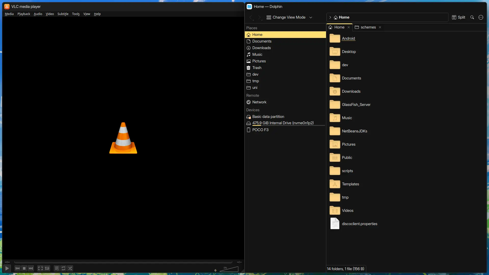
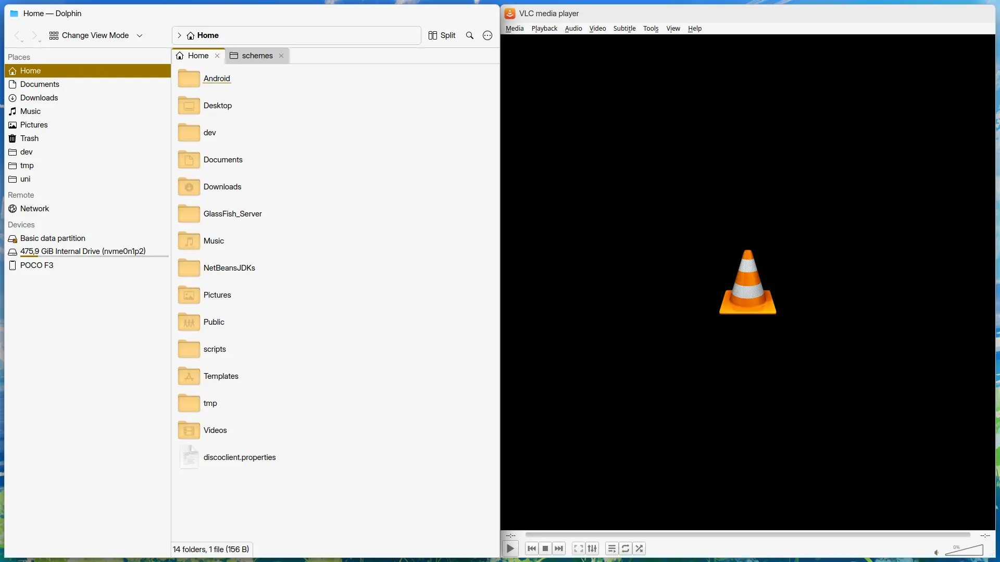

<div align="center">

  

  # Mono Code for KDE

  <div>
      
      
  </div>
</div>

# Install
To install a theme run the interactive install script.

```bash
# Clone Repository
git clone https://github.com/Mono-Code-Scheme/kde

# Run the install script
cd kde
./install.py
```

# Usage
Go to color settings in KDE and apply the theme (if not already applied in the install script)

# Maintainers
🐈‍⬛ lighttigerXIV
